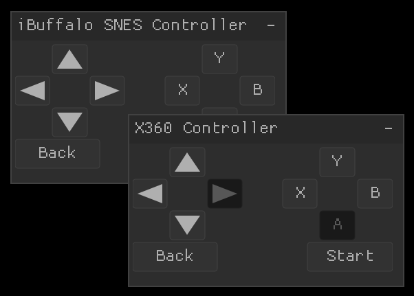

# nuklear_gamepad

Gamepad API for [Nuklear](https://github.com/Immediate-Mode-UI/Nuklear).



## Example

``` c
#define NK_GAMEPAD_IMPLEMENTATION
#define NK_GAMEPAD_SDL
//#define NK_GAMEPAD_GLFW
//#define NK_GAMEPAD_RAYLIB
//#define NK_GAMEPAD_PNTR
//#define NK_GAMEPAD_KEYBOARD
//#define NK_GAMEPAD_NONE
#include "nuklear_gamepad.h"

// Initialize the gamepad system.
struct nk_gamepads gamepads;
nk_gamepad_init(&gamepads, ctx, NULL);

// Act on whether or not the A button is pushed
if (nk_gamepad_is_button_down(&gamepads, 0, NK_GAMEPAD_BUTTON_A)) {
    nk_label(ctx, "Button A is down", NK_TEXT_LEFT);
}

// Clear the gamepad state.
nk_gamepad_free(&gamepads);
```

## Platform Support

- [SDL](https://www.libsdl.org/)
- [GLFW](https://www.glfw.org/)
- [raylib](https://www.raylib.com/)
- [pntr](https://github.com/robloach/pntr) with [pntr_app](https://github.com/robloach/pntr_app)
- [Add more!](https://github.com/RobLoach/nuklear_gamepad/issues)

## API

``` c
nk_bool nk_gamepad_init(struct nk_gamepads* gamepads, struct nk_context* ctx, void* user_data);
nk_bool nk_gamepad_init_with_source(struct nk_gamepads* gamepads, struct nk_context* ctx, struct nk_gamepad_input_source input_source);
void nk_gamepad_free(struct nk_gamepads* gamepads);
void nk_gamepad_update(struct nk_gamepads* gamepads);
nk_bool nk_gamepad_is_available(struct nk_gamepads* gamepads, int num);
void nk_gamepad_set_available(struct nk_gamepads* gamepads, int num, nk_bool available);
nk_bool nk_gamepad_is_button_down(struct nk_gamepads* gamepads, int num, enum nk_gamepad_button button);
nk_bool nk_gamepad_is_button_pressed(struct nk_gamepads* gamepads, int num, enum nk_gamepad_button button);
nk_bool nk_gamepad_is_button_released(struct nk_gamepads* gamepads, int num, enum nk_gamepad_button button);
nk_bool nk_gamepad_any_button_pressed(struct nk_gamepads* gamepads, int num, int* out_num, enum nk_gamepad_button* out_button);
void nk_gamepad_button(struct nk_gamepads* gamepads, int num, enum nk_gamepad_button button, nk_bool down);
int nk_gamepad_count(struct nk_gamepads* gamepads);
const char* nk_gamepad_name(struct nk_gamepads* gamepads, int num);
struct nk_gamepad_input_source* nk_gamepad_input_source(struct nk_gamepads* gamepads);
nk_bool nk_gamepad_set_input_source(struct nk_gamepads* gamepads, struct nk_gamepad_input_source input_source);
nk_gamepad_input_source_fn nk_gamepad_input_sources[];
```

## Custom Integration

To define your own custom input source, use `NK_GAMEPAD_NONE` and pass in your own `struct nk_gamepad_input_source`...

```c
#define NK_GAMEPAD_NONE
#define NK_GAMEPAD_IMPLEMENTATION
#include "nk_gamepad.h"

// Globals
struct nk_gamepads gamepads;

// Initialize the gamepad.
struct nk_gamepad_input_source source = {
    .user_data = NULL, // Optional user_data pointer
    .init = NULL, // Function to initialize the input source
    .update = &my_own_gamepad_update, // Function to update the status of the gamepad
    .free = NULL, // Function used to free up the gamepad data
    .name = NULL, // Function used to get the name of each gamepad
    .input_source_name = "my_own_gamepad", // The optional name of the input source
    .id = 1234, // Optional identification for the input source
};
nk_gamepad_init_with_source(&gamepads, ctx, struct nk_gamepad_input_source input_source);

// Update the gamepad status
nk_gamepad_update(&gamepads);

// Free it
nk_gamepad_free(&gamepads);
```

## Configuration

| Define | Description  |
| ------ | ------------ |
| `NK_GAMEPAD_NONE`     | When set, will avoid detecting which platform to use |
| `NK_GAMEPAD_SDL`      | Use [SDL](https://www.libsdl.org/) |
| `NK_GAMEPAD_GLFW`     | Use [glfw](https://www.glfw.org/) |
| `NK_GAMEPAD_RAYLIB`   | Use [raylib](https://github.com/raysan5/raylib) |
| `NK_GAMEPAD_PNTR`     | Use [pntr_app](https://github.com/robloach/pntr_app) |
| `NK_GAMEPAD_KEYBOARD` | Use Nuklear's keyboard interface to emulate gamepad input |
| `NK_GAMEPAD_INIT`     | Callback used to initialize gamepads |
| `NK_GAMEPAD_UPDATE`   | Callback used to update all gamepad states |
| `NK_GAMEPAD_NAME`     | Callback used to get a controller's name |
| `NK_GAMEPAD_FREE`     | Callback used to disconnect the controllers |

## License

Unless stated otherwise, all works are:

- Copyright (c) 2026 [Rob Loach](https://robloach.net)

... and licensed under:

- [zlib License](LICENSE)
